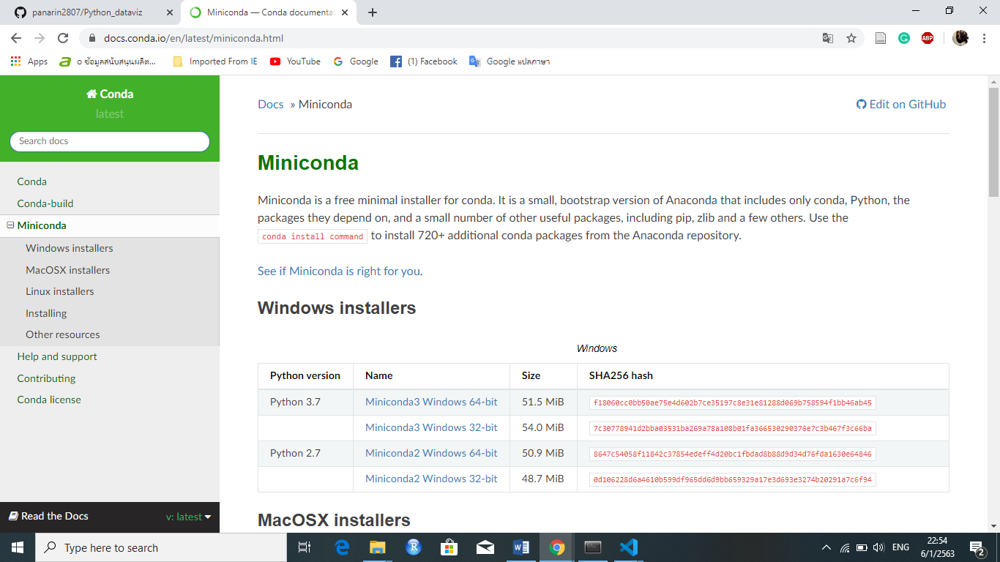
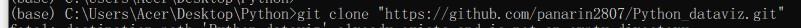

# **Python_dataviz**
# **น.ส.ภานรินทร์  อิ่นแก้ว รหัสนักศึกษา 603021110-2** 
# **1. การติดตั้ง Python**
1) ค้นหาคำว่า "miniconda" เพื่อทำการติดตั้ง Anaconda Promt

2) ทำการดาวน์โหลดโดยเลือกให้เหมาะสมกับระบบปฏิบัติการของคอมพิวเตอร์ผู้ใช้งาน

3) เมื่อทำการติดตั้งเสร็จสิ้น โปรแกรมจะมีลักษณะดังต่อไปนี้

4) ทำตรวจเช็คว่าเครื่องคอมพิวเตอร์ได้ทำการติดตั้ง Python หรือไม่? โดยใช้คำสั่ง Python ผลที่ได้คือเครื่องคอมพิวเตอร์ได้ทำการติดตั้ง Python 3.7.3 เรียบร้อยแล้ว

# **2. การใช้งาน Google Colab**
1) ค้นหาคำว่า "Google Colab"

นี่คือหน้าเว็บไซต์ดังกล่าว

2) ทำการ sign in หรือการเข้าสู่ระบบทางด้านขวาของหน้าต่างเว็บไซต์

เมื่อคลิกเข้าไปแล้วจะมายังหน้าต่างที่ใช้ในการกรอก E-mail เพื่อเข้าสู่ระบบ

3) เมื่อทำการเข้าสู่ระบบเสร็จสิ้นแล้วจะแสดงหน้าต่างดังต่อไปนี้

เราสามารถเข้าทำงานต่อตามไฟล์งานที่บันทึกไว้หรือสามารถเพิ่มไฟล์งานใหม่ โดยคลิกไปที่ NEW PYTHON 3 NOTEBOOK
# **3. การติดตั้ง github**
1) ทำการสมัครสมาชิกและเข้าสู่ระบบที่เว็บไซต์ github.com

2) เมื่อทำการเข้าสู่ระบบแล้วให้ทำการ install git ในโปรแกรม Anaconda Prompt

3) สร้างที่เก็บข้อมูลโดยคลิกที่ New Repository

4) ทำการตั้งชื่อที่เก็บข้อมูล(Repository)และคลิกที่ Create Repository

5) ทำการดาวน์โหลดโปรแกรม Visual Studio Code

6) ทำการเชื่อมโดยการใช้คำสั่ง git clone "URLของผู้สมัคร" ในโปรแกรมAnaconda Prompt

7) ใช้คำสั่ง git status เพื่อตรวจสอบว่ามีไฟล์ข้อมูลใดบ้างที่ยังไม่เชือมกับ github
8) ใช้คำสั่ง git commit -m "..." เป็นคำสั่งที่คล้ายกับการ commentว่าเราทำอะไรกับไฟล์นี้อยู่
9)ใช้คำสั่ง git push เพื่อดันงานที่ทำการบันทึกอยู่ที่คอมไปไว้ใน GitHub หรือในอินเทอร์เน็ต
